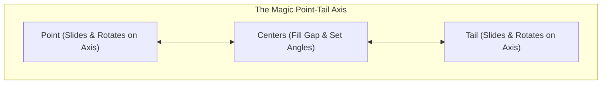
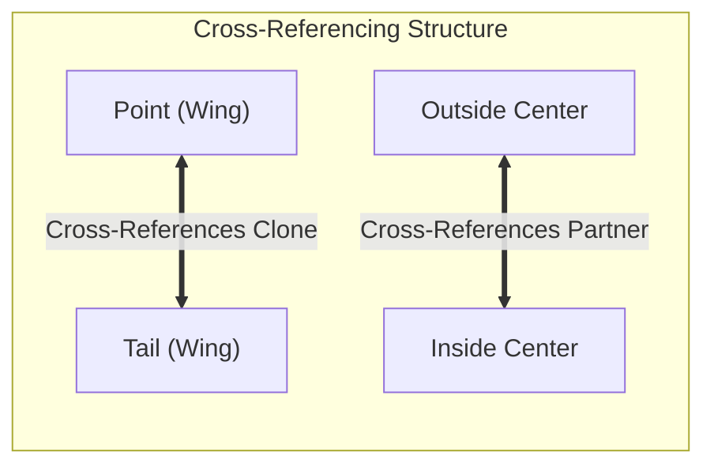
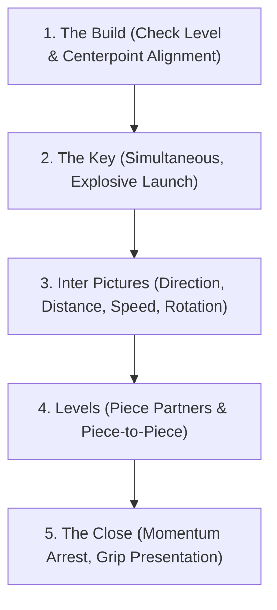
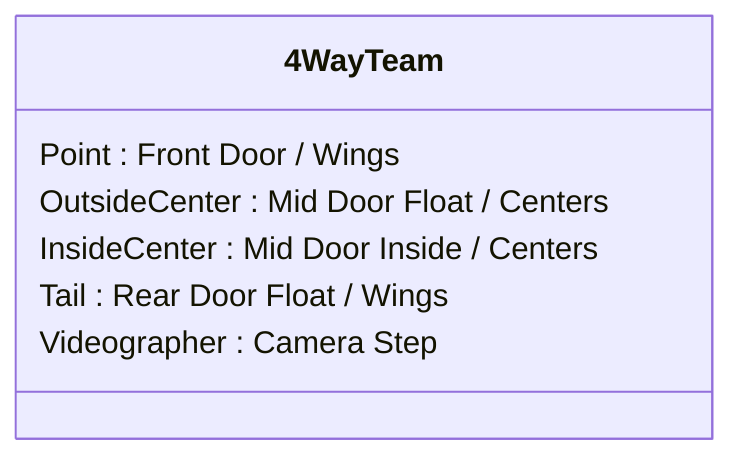
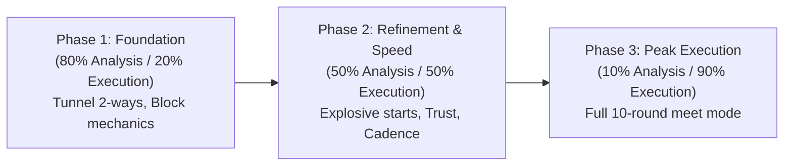

# 4-Way Formation Skydiving (Relative Work) Master Knowledge Base & Training Guide

> **Scope**: Relative 4-Way Formation Skydiving (Belly-to-Earth / Flat FS). Excludes VFS (Vertical Formation Skydiving).  
> **Authoritative Sources**: SDC Rhythm XP, Axis Flight School, Fury Coaching (Christy Frikken), Arizona Airspeed, PACKD Training Systems, and FAI/ISC Competition Rules.

---

## Table of Contents
1. [Foundations & Competition Format](#1-foundations--competition-format)
2. [Briefing, Rehearsal & Ground Preparation](#2-briefing-rehearsal--ground-preparation)
3. [Personal Flight Skills & Aerodynamics](#3-personal-flight-skills--aerodynamics)
4. [Minimizing Movement & Formation Geometry](#4-minimizing-movement--formation-geometry)
5. [Head Switching & Reference Work](#5-head-switching--reference-work)
6. [Random Work: Flow, Sight Pictures & Flashing](#6-random-work-flow-sight-pictures--flashing)
7. [Block Technique & Mechanics](#7-block-technique--mechanics)
8. [Key Mechanics & Improving Key Time](#8-key-mechanics--improving-key-time)
9. [Cadence, Anticipation & How to Get Faster](#9-cadence-anticipation--how-to-get-faster)
10. [Team Dynamics, Slots & Season Architecture](#10-team-dynamics-slots--season-architecture)
11. [Effective Debriefing Methodology](#11-effective-debriefing-methodology)
12. [Complete 4-Way Dive Pool Reference (FAI-ISC)](#12-complete-4-way-dive-pool-reference-fai-isc)

---

## 1. Foundations & Competition Format

Relative 4-Way Formation Skydiving (FS) is the discipline of flying flat (belly-to-earth) in a team of four performers plus one videographer. The team executes a predetermined sequence of formations drawn from the official FAI/ISC dive pool within a strict working time.

### Key Competition Parameters
- **Working Time**: 
  - **35 seconds** in standard FAI/ISC and USPA competitions.
  - Timer begins the instant the first performer leaves the aircraft.
  - For training/tunnel, working time can be adjusted (e.g., 20s speed sprints, 60s endurance training).
- **The Draw**:
  - Each competition typically consists of **10 rounds**.
  - Rounds are randomly drawn from the pool to form sequences of 5 to 6 points (or until reaching 5 or 6 scoring formations).
- **The Dive Pool Structure**:
  - **16 Random Formations** (Designated A through Q, excluding J). Each random is worth **1 point**.
  - **22 Blocks** (Numbered 1 through 22). Each block consists of an initial formation, an intermediate motion (breaking into subgroups or solos, turning prescribed degrees), and a closing formation. Each completed block is worth **2 points** (1 point for the initial build/break, 1 point for the completed second formation).
- **Scoring & Busts**:
  - Formations must be completely built with correct grips on specified body parts (wrist, ankle, etc.) with all extraneous grips released.
  - Any grip taken before complete separation of the prior formation or incorrect grip placement results in an evaluation of **0 points** (a bust / omission).
  - Videographer must clearly capture every grip and separation; obscured grips cannot be scored.

---

## 2. Briefing, Rehearsal & Ground Preparation

Preparation on the ground directly determines execution in the air. Professional teams follow a structured progression from draw to exit.

### 2.1 The Walk-Dive ("Walk This Way")
- **Purpose**: Establishes body headings, slot rotations, spatial choreography, and sightlines on your feet.
- **Rhythm & Flow**: Walk the dive at a continuous, steady pace. Avoid stopping abruptly to debate details while walking; identify issues, discuss them stationary, then walk the whole dive continuously from start to finish.
- **Eye Contact & Sightlines**: Look at the actual teammate or clone you will look at in freefall. Do not look down at the floor or at your own feet.

### 2.2 Creeping (On Creepers)
- **Angles vs. Rolling**: 
  - Avoid rolling your creepers over excessive distances. Use the creeper wheels to practice precise rotational pivots around your center point.
  - Position your belly button on a reference line (e.g., a crack in the creeper pad or tape line) to ingrain centerpoint discipline.
- **Stop Drills on Creepers**:
  - Practice the sequence: *Key -> Flash -> Move -> Stop -> Grip*.
  - Every teammate moves to their designated slot, holds off with zero contact, and only grips once everyone is verified in position and stable.
- **Grip Presentation**: Practice presenting soft, accessible grippers rather than snatching at each other.

### 2.3 Mock-Up Drills (Aircraft Exits)
- **Aircraft Specifics**: Rehearse in a mock-up matching the aircraft type (Twin Otter, Skyvan, Porter, Caravan, PAC 750).
- **Exit Stance**:
  - **Outside Center (OC)**: Poised outside, left or right foot on the float rail/step, hips square to relative wind, balanced and spring-loaded.
  - **Tail**: Hanging outside or deep rear crouch, ready for an immediate aggressive drop down into the airflow.
  - **Point**: Inside front corner, tucked tight, preparing to launch high and present down onto the hill.
  - **Inside Center (IC)**: Inside center doorway, ready to sneak low beneath the outside center.
  - **Videographer**: Outside camera step, synced with the exit cadence.
- **The Count**:
  - Given by the Outside Center (or designated counter).
  - Clear, distinct, non-verbal cadence (e.g., foot/leg pump or head nod): *Out - In - Arch / Launch*.
  - All four flyers must break the plane of the door simultaneously.

### 2.4 Visualization Mastery (The "Matrix" Method)
- **1st Person vs. 3rd Person**:
  - 1st Person: Seeing through your own eyes inside the helmet—crucial for muscle memory, sight pictures, and visual keys.
  - 3rd Person: Seeing the formation from the camera angle—useful for overall geometry and centerpoint awareness.
- **The "Matrix" Anticipation Drill** (Christy Frikken / Fury Coaching):
  - Mentally visualize your move toward a formation.
  - Just before reaching your slot, slow down the mental replay into super slow-motion.
  - During this slow-motion buffer, *call up the mental image of the next formation*.
  - Resume normal speed, close the grips, and transition instantly into the next move.
  - This conditions the brain to always stay one point ahead of the physical body.

### 2.5 The Climb to Altitude & Rituals
- **Analysis to Execution Shift** (SDC Rhythm XP):
  - **Climb to 5,000 ft (80% Execution / 20% Analysis)**: Final mental checks, reviewing one key detail for exit and one for the dive.
  - **Handshake to Red Light (90% Execution)**: Team handshake, gear pin checks, closing eyes for silent visualization.
  - **Red Light to Door (~100% Execution)**: Zero technical analysis. High energy, smiling, deep diaphragmatic breathing.
- **Arousal Control & Dan BC's 5 C's**:
  - **Calm**: Deep, rhythmic breathing; shaking out forearm and neck tension.
  - **Confident**: Positive internal self-talk; absolute trust in teammates.
  - **Committed**: 100% focus on execution, ignoring external score pressure.
  - **Centered**: Solid core balance, grounded posture.
  - **Conscious**: Broad field of vision, acute peripheral awareness.

---

## 3. Personal Flight Skills & Aerodynamics

High-speed formation skydiving requires subconscious control of individual body flight. Energy spent stabilizing individual flight is energy stolen from cadence and block execution.

### 3.1 The Modern Mantis Body Position
The Mantis is the universal flat-flying posture for competitive 4-way:

| Body Segment | Mantis Positioning | Purpose / Aerodynamic Effect |
| :--- | :--- | :--- |
| **Head & Chin** | Chin held high, eyes looking up through eyebrows | Keeps cervical spine extended, opens chest, maintains forward horizon |
| **Chest & Torso** | Broad chest, hips and glutes pressed downward | Creates primary dihedral stability, anchors center of mass |
| **Arms & Elbows** | Elbows forward and slightly below shoulder level; hands relaxed in front of face | Forms an aerodynamic wedge; eliminates burble across torso; instant reach |
| **Legs & Knees** | Knees shoulder-width apart; lower legs extended ~90°–100° | Exposes booties to clean airflow; provides maximum forward drive and yaw authority |
| **Feet & Booties** | Heels angled slightly inward, toes pointed | Maximizes surface area of booties; prevents fluttering and yaw instability |

### 3.2 Turning in Place (Center of Rotation)
- **The Golden Rule**: An in-place turn must rotate purely around the performer's navel (center of mass / center of pressure).
- **Common Faults**:
  - "Carving" or "wobbling" where the head or feet swing around an offset circle.
  - Banking or dumping air, causing fall rate fluctuations during turns.
- **Pure Turn Mechanics**:
  - **Elbow**: Near elbow (e.g., right elbow for a right turn) dips down ~30°. Far hand points toward that elbow.
  - **Legs**: Far knee (left knee for a right turn) presses downward and slightly outward using hip flexors and quads—*not* by bending the knee deeper.
  - Both legs maintain constant, firm air pressure on booties.

### 3.3 Superposition (Simultaneous Translation + Rotation)
- **Definition**: Superposition is the simultaneous execution of translation (forward/back or lateral slide) and rotation (90°, 180°, or 360° turn) in a single unified flight vector.
- **Why It Matters**:
  - Amateur: Completes turn -> stops -> slides -> stops -> grips (wastes 1.5–2 seconds).
  - Master: Turns while sliding, arriving on heading and in position at the exact millisecond of arrival.
- **Tunnel Drills for Superposition**:
  - *Open Accordion -> 180° -> Stairstep*: Rotate 180° while driving across the center.
  - *Star -> Sidebody -> Star*: Continuous lateral slide blended with 90° rotation.
  - *360° In-Place vs. 360° Orbit*: Learn to isolate a pure center turn from an orbit around a point.

### 3.4 Momentum Management: Start - Coast - Stop
Every freefall displacement consists of three distinct phases:
1. **Start (Initiation)**: Assertive, explosive input to create momentum in the intended direction.
2. **Coast (Neutral)**: Returning immediately to neutral body position while inertia carries you along the trajectory.
3. **Stop (Active Counter-Braking)**: Applying an equal and opposite aerodynamic counter-force to bring the body to an instantaneous dead stop exactly in slot.
> [!CAUTION]
> If you do not actively apply the **Stop** phase, you will either overshoot the formation, collide with teammates, or float/sink due to residual vertical speed.

---

## 4. Minimizing Movement & Formation Geometry

Speed in 4-way is inversely proportional to the volume of airspace the team consumes. Compact teams are fast teams.

### 4.1 The Magic Point-Tail Line (Centerpoint Discipline)
- **The Concept** (Christy Frikken / Fury Coaching):
  - Imagine a straight laser line passing through the navels of the Point and the Tail.
  - **Rule 1: Point and Tail Slide Along the Line**: Point and Tail can move toward or away from each other along this axis, expanding or contracting the space as needed.
  - **Rule 2: Point and Tail Rotate on the Line**: They can turn to any heading, but their center of gravity stays locked on this line.
  - **Rule 3: Centers Fit the Middle**: Outside Center and Inside Center fill the central space between Point and Tail with minimal translation.
- **Result**: The team rotates and reshapes around a stationary geographical centerpoint rather than drifting across the sky.

### 4.2 Quadrant Discipline
- Divide the 4-way airspace into four 90° quadrants meeting at the team centerpoint.
- Each flyer owns their quadrant.
- Never cross the quadrant line into a teammate's space unless executing a scripted crossover block (e.g., Block 21 Zig Zag - Marquis).
- When catching grips, let the grippers come to the boundary of your quadrant rather than reaching across into your partner's air.

### 4.3 Flying the Shape vs. Reaching for Grips
- **The "Reaching Trap"**: Extending arms out straight to snatch a distant grip pulls your torso forward, dumps air from your chest, and introduces pitch/roll wobbles.
- **The Correct Technique**: Fly your torso into the exact slot distance. Keep hands in the Mantis box. When your body arrives in position, the grips are naturally right in front of your hands.

---

## 5. Head Switching & Reference Work

### 5.1 The Art of Head Switching
A "Head Switch" occurs when a flyer must dramatically change their visual focus (often 90° to 180° across their shoulder or behind them) without altering their body flight heading or level.

- **The Biomechanical Challenge**: Turning the neck often inadvertently torques the shoulders, rotates the torso, or drops an elbow, causing an unwanted turn or roll.
- **Isolation Technique**:
  - Keep the collarbone and shoulders locked square to your flight heading.
  - Rotate purely at the cervical spine.
  - Keep the chin elevated to prevent pitching down.
  - Maintain firm, balanced pressure on both booties so leg drive does not deflect.

### 5.2 Cross-Referencing: "Find Your Clone"
Cross-referencing is the practice of anchoring your position, level, and cadence off the flyer on the opposite side of the formation.

- **Why You Look at Your Clone**:
  - **Planar Trim**: If two adjacent flyers have a 2-inch level discrepancy, that error multiplies across four flyers into an 8–10 inch step. Looking at your clone across the formation ensures the entire 4-way stays planar.
  - **Angle Verification**: You cannot accurately gauge your body angle by looking at the person you are touching. You can only verify your angle relative to the whole formation by referencing your clone.
  - **Early Warning**: Looking across the formation lets you see keys, block progression, and adjustments instantly.

### 5.3 Unsymmetrical Formations & Obscured Views
- In unsymmetrical formations (e.g., Adder, Yuan, Hook), identify the primary grip line and anchor off the flyer at the opposite end of that line.
- If your clone is physically blocked by teammates' bodies, look for a secondary visual anchor (a knee, foot, or rig) or lock eyes with the center flyer closest to the line of sight.

---

## 6. Random Work: Flow, Sight Pictures & Flashing

Randoms are single formations (Letters A through Q). In high-level 4-way, random work is executed in a continuous, rhythmic flow.

### 6.1 The Cadence of Randoms: Stop-Then-Grip vs. Continuous Flow
- **The Training Progression (PACKD / Airspeed Method)**:
  - *Phase 1 (Stop Drills)*: Key -> All release -> Fly to slot -> **Dead Stop (Zero Contact)** -> Verify stable -> Simultaneous Grip.
  - *Phase 2 (Subconscious Flow)*: As flight skill matures, the "Stop" and "Grip" merge into an instantaneous closure. The flyer flies smoothly through the air, decelerates cleanly into position, and closes grips without hesitation.
- **Eliminating "Pumping Syndrome" & "The Rollercoaster Effect"**:
  - Pumping syndrome occurs when flyers bounce up and down vertically between points.
  - Remedy: Lock in a uniform team fall rate; fly strictly on level; never pull up or push down to grab a grip.

### 6.2 Presenters vs. Takers
In every random formation, each grip involves a **Presenter** and a **Taker**:
- **Presenter**:
  - Flies to their coordinate, establishes heading, and presents their gripper (wrist or ankle) in clean, steady air.
  - Keeps the gripper stationary; does *not* reach toward the taker.
- **Taker**:
  - Flies their body into position and gently takes the presented gripper.
  - Does *not* snatch, yank, or pull the presenter off balance.

### 6.3 Flashing Discipline (No-Touch Flashing)
- Under FAI rules, complete separation must be visible between formations.
- **The Flash**:
  - When releasing grips, hands/legs must clearly separate before taking the next grip.
  - Avoid "lazy releases" or sliding hands along fabric, which will be scored as a **bust** by competition judges.
  - Practice clear, open-palm releases (internal flash or wide flash) during creeping and tunnel drills.

---

## 7. Block Technique & Mechanics

Blocks (Numbered 1 through 22) are the defining test of 4-way skill. Each block consists of an initial formation, a prescribed intermediate maneuver involving subgroups or solos, and a second formation.

### 7.1 The 5-Step Block Debrief & Execution Framework (SDC Rhythm XP)
When learning, flying, or debriefing any block, follow these five steps in strict sequential order:

1. **Step 1: The Build**
   - Did the initial formation build on-center, on-level, and without tension?
   - If the initial build is crooked or stretched, the block is doomed before it starts.
2. **Step 2: The Key**
   - Did everyone release simultaneously?
   - Did piece partners initiate movement at the exact same millisecond?
3. **Step 3: Inter Pictures**
   - An *Inter Picture* is the specific snapshot of how the subgroups look halfway through the maneuver.
   - Evaluate the 4 Inter Criteria:
     - **Direction**: Did each piece fly its exact scripted compass bearing?
     - **Distance**: Did pieces separate to the proper distance (neither too tight nor blown out wide)?
     - **Speed**: Did both pieces move at matching, symmetrical speeds?
     - **Rotation**: Did spinning pieces complete their exact degree of rotation without over- or under-rotating?
4. **Step 4: Levels**
   - Evaluate levels between piece partners within each subgroup.
   - Evaluate levels between the two separate pieces.
5. **Step 5: The Close**
   - Did flyers arrest their momentum cleanly?
   - Were grips presented clearly and closed simultaneously?

### 7.2 On-Level vs. Vertical Block Techniques
Many blocks offer a choice between keeping all flyers on the same horizontal plane (On-Level / Flat) or having one piece fly vertically over the other (Vertical):

- **Vertical Blocks** (e.g., Blocks 1, 5, 6, 11, 13, 18, 20, 21, 22):
  - **Over Piece**: Typically Outside Center and Point. They generate a slight pop of lift, flying over the burble of the lower piece.
  - **Under Piece**: Typically Inside Center and Tail. They sink slightly or maintain level while driving underneath.
  - **Advantage**: Allows pieces to cross paths in a tighter physical radius without colliding.
- **On-Level Blocks**:
  - Both pieces stay on the same plane, requiring wider radial clearance or staggered timing.
  - Preferred in tight wind tunnels or by teams with perfectly matched fall rates.

---

## 8. Key Mechanics & Improving Key Time

The "Key" is the signal that releases the current formation to initiate the next move. In a 35-second working time, cutting 0.2 seconds off every key across 30 points yields **6 full seconds of extra scoring time** (equivalent to 4–6 additional points).

### 8.1 Key Responsibilities & Types of Keys
- **Primary Key Slot**: **Inside Center (IC)** is the traditional primary key person because the IC occupies the central visual hub of the formation.
- **Shared / Secondary Keys**: When the IC cannot see the final grip closure (e.g., an outfacing formation or behind-the-back closure), the key is delegated to the specific flyer who takes the last grip.
- **Methods of Keying**:
  - **Visual Flash / Nod**: Sharp, deliberate nod of the head or chin drop.
  - **Foot / Leg Shake**: Twitch or bootie kick (common when hands/heads are constrained).
  - **Eye Contact Key**: Direct lock of eyes and sharp brow raise.

### 8.2 Do Pro Skydivers Really Wait for the Key?
- **The Myth**: Pros wait until a formation is fully held, stare at it, see a key, react, let go, and start moving.
- **The Reality** (Christy Frikken / Fury Coaching):
  - Pro flyers operate on **anticipatory cadence**.
  - All four flyers know the exact instant the final grip will close.
  - The key is a confirmation pulse, not a surprise alarm.
  - Flyers release *with* the key, not *after* the key.

### 8.3 Drills to Accelerate Key Time
1. **Flash Keys**: The key person keys the absolute millisecond the last hand contacts fabric—not after holding it for a half-second.
2. **Peripheral Grip Spotting**: The key person does not swivel their entire head to inspect every grip; they use peripheral vision and clone referencing to verify completion.
3. **Tunnel Stop Drills with Keyer**: Practice having the keyer call the release verbally in the tunnel until the team's release reaction is instantaneous.

---

## 9. Cadence, Anticipation & How to Get Faster

### 9.1 Cadence & Flow Over Raw Speed
- A chaotic, rushed team that flies in bursts followed by hesitation will score lower than a smooth, rhythmic team.
- A consistent cadence (e.g., 1.2 to 1.5 seconds per point) creates predictable momentum, allowing teammates to anticipate grips and maintain calm heart rates.

### 9.2 Eliminating Pauses: The "Whack-a-Mole" Trap
- Amateurs play "whack-a-mole": they finish a move, stop completely, look around, identify the next move, and then start flying.
- High-performance teams eliminate the pause between formations. The completion of one formation is the literal launchpad of the next.

### 9.3 Over-Speed & 2-on-2 Training
- **2-on-2 Coaching**: Two team members fly with two professional coaches. The coaches set a blistering pace, pulling the students past their comfort zone and ingraining rapid visual processing.
- **Over-Speed Sets**: In the tunnel or sky, dedicate sets where the goal is to fly 20% faster than normal, even if it gets sloppy. This expands the team's perceptual bandwidth. When returning to normal competition pace, everything feels slower and easier to manage.

---

## 10. Team Dynamics, Slots & Season Architecture

### 10.1 The 4 Slots Defined

| Slot | Aircraft Exit Position | Freefall Orientation | Primary Role & Physics | Ideal Performer Attributes |
| :--- | :--- | :--- | :--- | :--- |
| **Point** | Inside front of door | Predominantly outfacing | Flies the front wing; presents grips in randoms; large solo block spins; flies "over" in verticals | Agile, lightweight/flexible, high spatial independence |
| **Outside Center (OC)** | Outside door (floater) | Mixed in/outfacing | Athletic exit launch; sets formation angles and distances with IC; high rotational volume | Gymnastic, dynamic, rhythm setter, high stamina |
| **Inside Center (IC)** | Inside door (middle) | Predominantly infacing | Sneaks low on exit; primary team keyer; anchors the center; takes heavy grips; flies "under" in verticals | Rock-solid stability, high skydiving IQ, calm under pressure |
| **Tail** | Outside rear door | Predominantly infacing | Aggressive drop exit; drives rear subgroup pieces in blocks; takes cat grips; closes rear of formation | Physically strong, powerful leg drive, excellent reaction speed |
| **Videographer** | Outside camera step | Overhead / Planar | Flies steep angle over formation; maintains frame; zero video busts; manages technical gear | Flawless fall rate range, consistent flying, calm, low drama |

### 10.2 Season Phasing (Airspeed & Rhythm Models)

- **Phase 1: Foundation (Months 1–3)**
  - Focus: Block mechanics, 2-way tunnel drills, perfecting exits, establishing communication.
  - Debriefing: Highly detailed, technical analysis.
- **Phase 2: Trust & Speed (Months 4–7)**
  - Focus: Cadence, explosive block starts, shortening key time, local competitions.
  - Debriefing: Measuring times (seconds to 2nd point out the door, cycle pace).
- **Phase 3: Execution & Taper (Months 8–10)**
  - Focus: Full 10-round competition simulations, managing weather holds, performing under fatigue.
  - Debriefing: Minimal technical tweaking; heavy focus on mental game, attitude, and process adherence.

### 10.3 Team Psychology & Resolving Conflict
- **Self-Critique First**: In debriefs, each flyer speaks only about their own performance before any team-wide discussion.
- **Leave It on the Landing Area**: Meet debriefs should be brief. Frustration or technical debates are not permitted on the packing mat; log them for an evening review session.
- **Mistake Culture**: Mistakes are required data points for learning. A team that never makes mistakes during training is not pushing the speed envelope.

---

## 11. Effective Debriefing Methodology

A structured debriefing process ensures rapid learning without draining team energy.

### 11.1 The 3-Part Debrief Structure
0. **Context & Goals Reminder**: State what phase of training the team is in and what the specific goal for this jump was (e.g., "Keep inter pictures tight on Block 21").
1. **Objective First Viewing ("What Happened?")**:
   - Watch the entire jump from start to finish without pausing or talking.
   - Count points objectively. Note busts and timing metrics.
2. **Personal & Team Evaluation ("What Did We Do Well? What Can We Improve?")**:
   - Go around the circle: Point -> Outside Center -> Inside Center -> Tail -> Videographer.
   - Each person states what they did well regarding the jump goal, and one specific adjustment.
3. **Action Items for Next Flight**:
   - Agree on 1 or 2 concrete actionable takeaways for the next jump or creep session.

---

## 12. Complete 4-Way Dive Pool Reference (FAI-ISC)

### 12.1 The 16 Random Formations (1 Point Each)

| Letter | Name | Description & Grip Structure | Typical Engineering / Presentation |
| :---: | :--- | :--- | :--- |
| **A** | **Unipod** | Inside Center and Outside Center grip Point; Tail grips Point or Center | Point outfacing; Centers anchor |
| **B** | **Stairstep Diamond** | 4-way staggered offset diamond with hand-to-leg/arm grips | Tail and Point set outer angles |
| **C** | **Murphy Flake** | Line/flake formation with alternating hand-to-wrist grips | Wide planar discipline |
| **D** | **Yuan** | Asymmetric formation with mixed wrist and ankle grips | IC anchors; Point presents ankle/wrist |
| **E** | **Meeker** | Double satellite/compressed hybrid | Centers lock tight; wings close ends |
| **F** | **Open Accordion** | Open zig-zag line with alternating wrist grips | Strict clone cross-referencing |
| **G** | **Cataccord** | Combination of 2-way Cat and 2-way Accordion | Tail takes cat grips; Point open |
| **H** | **Bow** | Bow-tie shaped formation with interlinked centers | Classic exit formation |
| **I** | **Satellite** | Open star variant with extended radial grips | High fall-rate sensitivity |
| **K** | **Hook** | Offset hook configuration with hand-to-leg grips | Precise knee-level presentation |
| **L** | **Adder** | Stepped zig-zag formation | Requires strict Point-Tail axis control |
| **M** | **Star** | Classical 4-way round star (hand-to-hand/wrist) | Foundation formation; pure quadrant test |
| **N** | **Crank** | Offset rectangular box with opposing grips | High torque potential; keep quiet air |
| **O** | **Satellite (Opposed)** | Opposed radial formation | Cross-referencing clone is essential |
| **P** | **Sidebody** | Classical sidebody formation (hand-to-hip/wrist) | Fundamental exit formation |
| **Q** | **Phalanx** | Linear side-by-side formation with parallel headings | Strict level matching across all 4 flyers |

*(Note: The letter "J" is omitted from the FAI-ISC random pool to avoid confusion with "I").*

---

### 12.2 The 22 Competition Blocks (2 Points Each)

| Block # | Initial Formation | Intermediate Maneuver (Inter) | Second Formation | Subgroup Split & Degrees |
| :---: | :--- | :--- | :--- | :--- |
| **1** | **Molar** | Front/Rear pieces break, rotate 270°/90° or 360° | **Molar** | 2-way / 2-way (Vertical or On-Level) |
| **2** | **Sidebody Donut** | Subgroups break; 180° rotation on designated axes | **Sideflake Donut** | 2-way / 2-way |
| **3** | **Sideflake Opal** | Pieces translate and rotate across center | **Turf** | 2-way / 2-way |
| **4** | **Monopod** | 360° piece rotation around central pin | **Monopod** | 2-way / 2-way (or Solo / 3-way) |
| **5** | **Opal** | 360° opposing rotation between 2-way pieces | **Opal** | 2-way / 2-way (Vertical or On-Level) |
| **6** | **Stardian** | Break to inter picture; rotate 180° | **Stardian** | 2-way / 2-way (Vertical or On-Level) |
| **7** | **Sidebuddies** | Pieces rotate 360° in opposite directions | **Sidebuddies** | 2-way / 2-way |
| **8** | **Canadian Tee** | Front piece slides/rotates over rear piece | **Canadian Tee** | 2-way / 2-way (Vertical or Flat) |
| **9** | **Cat + Accordion** | Subgroups break and swap positions | **Cat + Accordion** | 2-way / 2-way |
| **10** | **Diamond** | Pieces break, rotate 180°/360° to bunyip | **Bunyip** | 2-way / 2-way or Solos |
| **11** | **Photon** | Pieces break; 180° / 360° vertical crossover | **Photon** | 2-way / 2-way (Vertical or On-Level) |
| **12** | **Bundy** | Double 180° rotation across center | **Bundy** | 2-way / 2-way |
| **13** | **Mixed Accordion** | Pieces break, reverse direction and rebuild | **Mixed Accordion** | 2-way / 2-way (Vertical or On-Level) |
| **14** | **Bipole** | Opposed 360° piece spins | **Bipole** | 2-way / 2-way |
| **15** | **Caterpillar** | Break and translate into linear caterpillar | **Caterpillar** | 2-way / 2-way |
| **16** | **Compressed** | Pieces rotate 180° into open box formation | **Box** | 2-way / 2-way |
| **17** | **Danish Tee** | Subgroups turn and translate across center | **Murphy** | 2-way / 2-way |
| **18** | **Zircon** | Vertical or flat crossover with 180° turns | **Zircon** | 2-way / 2-way (Vertical or On-Level) |
| **19** | **Ritz** | Break to intermediate; rotate 180° | **Ice Pick** | 2-way / 2-way |
| **20** | **Piver / Viper** | Subgroups rotate and translate across center | **Viper / Piver** | 2-way / 2-way (Vertical or On-Level) |
| **21** | **Zig Zag** | Centers step out, wings cross over (180° turns) | **Marquis** | 2-way / 2-way (Vertical or On-Level) |
| **22** | **Tee** | Pieces rotate 180° across center | **Chinese Tee** | 2-way / 2-way (Vertical or On-Level) |

---

## 13. Summary Checklist for High-Performance 4-Way Training

1. **Before the Jump**:
   - [ ] Walk the dive at cadence with eye contact.
   - [ ] Creep on wheels using the "Flash -> Move -> Stop -> Grip" drill.
   - [ ] Mockup the exit with realistic count and door positions.
   - [ ] Execute the "Matrix" visualization drill to prime anticipation.
2. **During the Jump**:
   - [ ] Simultaneous, explosive exit launch onto the relative wind hill.
   - [ ] First formation built and keyed in under 3–5 seconds.
   - [ ] Maintain the "Magic Point-Tail Line" and quadrant boundaries.
   - [ ] Head switch cleanly without body torque.
   - [ ] Cross-reference your clone for level and planar alignment.
   - [ ] Instantaneous flash keys upon grip completion.
3. **During the Debrief**:
   - [ ] Watch the entire video once silently.
   - [ ] Check performance against the specific daily jump goal.
   - [ ] Follow the 5-Step Block Framework: Build -> Key -> Inter -> Levels -> Close.
   - [ ] Speak self-critiques first; define 1 or 2 concrete action items for the next round.
